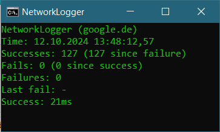
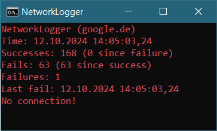

## NetworkLogger
Small windows bat file for logging ping times.

 

### Start
Simply download the `NetworkLogger.bat` file and start it. It will create a subfolder in the directory and save one log file per day there. If you like you can create a shortcut of the .bat file on your desktop and change the icon (only works with shortcuts).

### Output
The output is a semicolon-delimited CSV file with two columns, the timestamp and the ping response time. If the ping failed, the response time is set to `9999`.

### Settings
Edit the .bat file to set 
- the `server` that is being pinged
- the `repetitionTimeout` with which the ping is repeated in seconds 
- the `failureThreshold`, the number of fails that count as a failure (as well as the number of successes required to end a failure)
